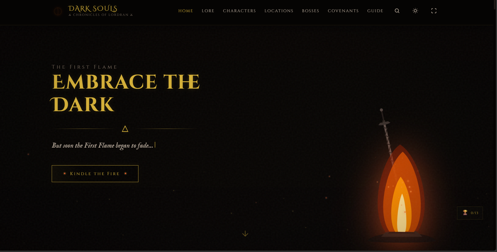
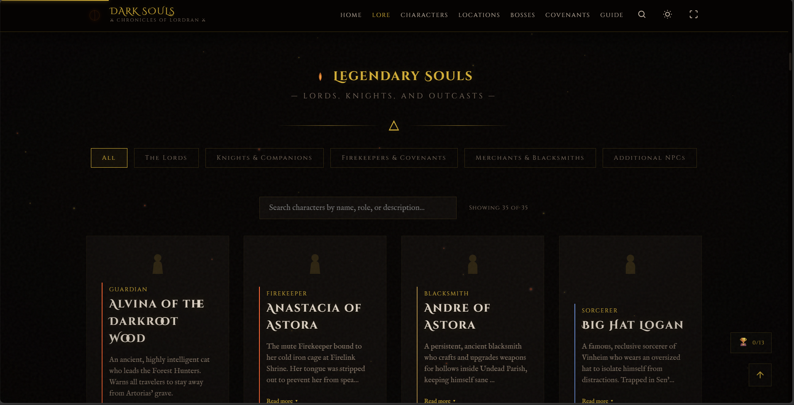
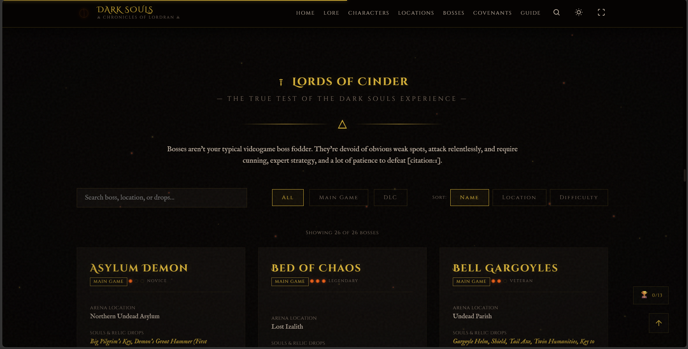
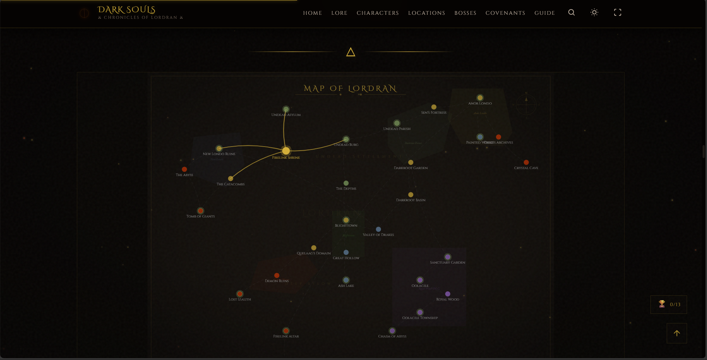
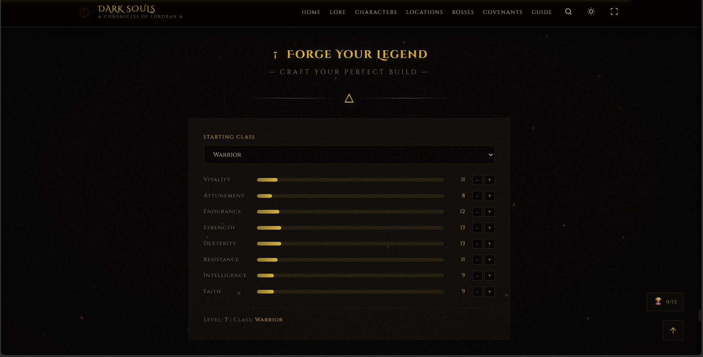

# Dark Souls — Chronicles of Lordran

A comprehensive, interactive guide to Dark Souls 1 featuring characters, bosses, locations, items, and more. Built with vanilla HTML, CSS, and JavaScript.

## Screenshots

| Home | Characters | Bosses |
|------|------------|--------|
|  |  |  |

| Map | Build Calculator | Dark Mode |
|-----|------------------|-----------|
|  |  |  |

## Features

### Content Sections
- **Hero** — Immersive bonfire with typewriter effect and parallax
- **Lore** — 5 expandable cards covering the Age of Fire
- **Characters** — 29 characters with search, filters, and detail modals
- **Legends** — 4 ultra-detailed SVG character portraits (Solaire, Siegmeyer, Artorias, Sif)
- **Locations** — Interactive parchment-style map with visited tracking
- **Bosses** — 26 bosses with search, filters, sort, difficulty ratings, and comparison mode
- **Covenants** — 9 factions with how-to-join and related NPCs
- **Key Items** — 12 iconic items with descriptions
- **Starting Gifts** — 8 starting gift options
- **Timeline** — 7 chronological events of Lordran
- **Quotes** — 45 rotating Dark Souls quotes with typing animation
- **Build Calculator** — 9 starting classes with adjustable stats
- **Weapons** — 12 weapons with search and filter
- **Armor** — 46 armor pieces with descriptions

### Interactive Features
- Global search (Ctrl+K or click search icon)
- Light/dark mode toggle
- Boss comparison modal
- Character detail modals
- Keyboard navigation support
- Visited region tracking (localStorage)
- Loading screen on page load

### Visual Effects
- Ambient floating particles (dust, embers, sparks)
- Parallax background effects
- Card hover glow effects
- Section reveal animations
- Vignette overlay
- Film grain noise texture
- Scroll progress bar

## How to Use

1. Open `index.html` in any modern web browser
2. Navigate using the header menu or scroll through sections
3. Use the search icon (or Ctrl+K) to search across all sections
4. Toggle light/dark mode with the sun icon in the header
5. Click character cards to view detailed modals
6. Use the build calculator to plan character builds
7. Search and filter weapons/armor by type

## Easter Eggs

### Keyboard Shortcuts
| Shortcut | Effect |
|----------|--------|
| `↑↑↓↓←→←→BA` | Konami Code — hue-rotate flash |
| Type `DARK` | Screen darkens with desaturation |
| Type `SOUL` | Soul blue glow effect |
| Type `ILLUSORY` | "Illusory wall ahead..." message |
| Type `BONFIRE` | Warm orange tint |
| Type `HOLLOW` | "Don't go hollow..." warning |

### Click Easter Eggs
| Action | Effect |
|--------|--------|
| Click bonfire 5 times | Bonfire flare animation |
| Scroll excessively (500+) | "YOU DIED" overlay |
| Visit 20+ locations | Secret quote in footer |
| Click Solaire card 3x | "PRAISE THE SUN!" |
| Click Siegmeyer card 3x | "Hmm... What's this?" |
| Click Artorias card 3x | Abyssal roar effect |
| Click Sif card 3x | Loyal howl message |

## Technologies Used

- **HTML5** — Semantic markup
- **CSS3** — Custom properties, gradients, animations, backdrop-filter
- **Vanilla JavaScript** — No frameworks or libraries
- **SVG** — Vector illustrations for characters and icons
- **localStorage** — Progress tracking and preferences
- **Service Worker** — Offline support

## File Structure

```
ds-archive/
├── index.html                  # Main HTML file
├── script.js                   # JavaScript functionality
├── styles.css                  # All styles
├── dark-souls.html             # Original single-file version
├── sw.js                       # Service worker for offline
├── README.md                   # This file
├── screenshots/                # Project screenshots
│   ├── home.png
│   ├── characters.png
│   ├── bosses.png
│   ├── map.png
│   ├── build-calculator.png
│   └── dark-mode.png
└── .github/workflows/
    └── deploy.yml              # GitHub Pages deployment
```

## Browser Support

- Chrome 80+
- Firefox 75+
- Safari 13+
- Edge 80+

## Credits

- Dark Souls is a trademark of FromSoftware/Bandai Namco
- Fan-made project for educational purposes
- All game quotes and lore belong to their respective owners

## License

This is a fan project. Dark Souls content belongs to FromSoftware and Bandai Namco.
